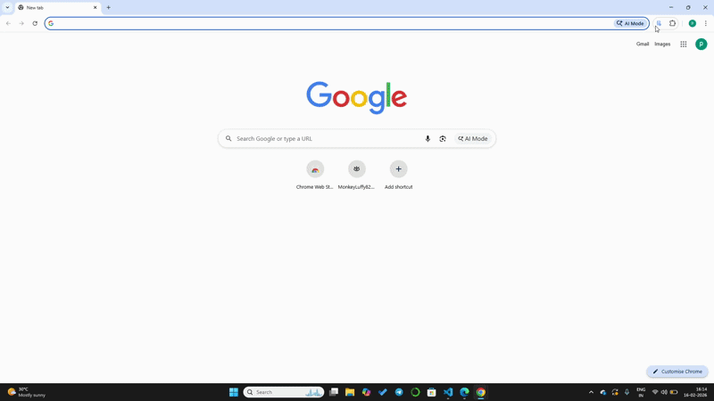

# salesforce-flow-analyzer
A Browser Extension that analyzes Salesforce Flow XML Files for best practices, performance issues and common mistakes, providing developers with instant feedback. No data is collected, files are processed in browser locally only.

## Overview
A fully offline browser extension that analyzes Salesforce Flow XML files to identify common issues and best-practice violations before deployment. Implemented a rule-based analyzer covering 12 checks, including governor-limit risks, security misconfigurations, and frequent design mistakes in declarative automation. Designed for instant feedback with no external dependencies, helping developers and admins catch problems early and improve Flow reliability.

## Features
### Comprehensive Analysis
- **12 Analysis rule** covering critical to low priority issues
- **4 severity levels**: Critical,High,Medium,Low
- **6 categories**: Governer Limits, Security, Best Practices, Maintainability, Documentation, Performance.
- **Fully Offline Processing:** Your flow logic is never sent to any external application, and no data is collected. XML files are processed locally in your browser only.

### UI & Export Capabilities:
- Clean and simple UI.
- Exports the results to csv.

## Usage
- click on extension icon in Browser toolbar.
- Upload the salesforce XML File.
- Click on "Start Analysis" Button.
- Review the results and Download the results as CSV.
- You can also check all 12 rules details in Rules Book Tab.

## Installation:
-Edge Browser: https://microsoftedge.microsoft.com/addons/detail/kdaladfndjjgjlaflegomjnfpaipcfid
- Chrome Browser : https://chromewebstore.google.com/detail/salesforce-flow-analyzer/khebcjhnfkfggngggmpdlaefnmhkpnmi

## Rules:
| Name | Description | Category | Priority |
|------|-------------|----------|----------|
| Flow Has Description | Checks if flow has a description explaining its purpose | Documentation | Low |
| Elements Have Labels | Checks for generic default names like `Loop_1` etc | Maintainability | Low |
| Outdated API Version | Checks if flow uses an old Salesforce API version | Best Practices | Low |
| Variable Descriptions | Checks if variables have descriptions or not | Documentation | Low |
| Flow Complexity | Checks if Flow has too many elements (over 75) | Maintainability | Medium |
| Hardcoded Record IDs | Checks for hardcoded Salesforce IDs that break when deployed to other orgs | Security | Critical |
| SOQL in Loops | Checks if queries are inside loops | Governor Limits | Critical |
| DML in Loops | Checks if record operations are inside loops | Governor Limits | Critical |
| Missing Fault Paths | Checks if record operations have error handling configured | Best Practices | High |
| Missing Null Checks | Checks if flow verifies Get Records before using them | Best Practices | High |
| Formula Complexity | Checks for long or complex formulas (over 300 characters) | Maintainability | Low |
| Unused Variables | Checks for variables that are declared but never used | Best Practices | Low |

## Demo:

## Screenshots
Main Page:

Upload XML File:

Analyze Tab:

Results:

Error When non-XML File is uploaded:

Error when non-salesforce XML file is uploaded:

Download as CSV:

## RoadMap:
**Current Version:1.0.0**
  - 12 Analysis rules.
  - CSV Export
  - XML Validations and Simple UI.

**Future Considerations:**
  - JSON Export Option
  - Multiple File Analysis
  - Custom Rule Configurations.

## License:
This project is licensed under the MIT License.

